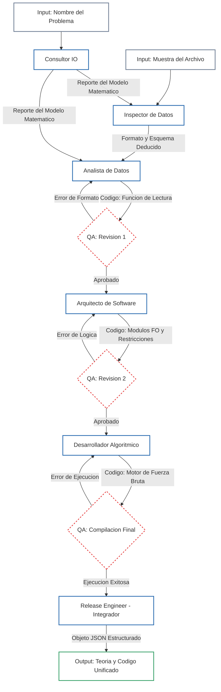

# AI Optimization Crew

Este repositorio contiene un sistema multi-agente basado en [CrewAI](https://crewai.com/) diseñado para automatizar la resolución de problemas de optimización matemática (como el Problema de la Mochila Multidimensional - MKP). 

El sistema utiliza agentes de Inteligencia Artificial impulsados por Google Gemini para:
1. **Modelar matemáticamente** el problema (Función Objetivo y Restricciones).
2. **Realizar ingeniería inversa** sobre archivos planos de instancias de datos.
3. **Escribir código modular** en Python (lectura, evaluación y algoritmos de fuerza bruta).
4. **Ejecutar QA autónomo**, probando el código generado en un entorno aislado para corregir errores antes de la entrega final.

## Estructura del Proyecto

El proyecto está diseñado de forma modular para facilitar su escalabilidad:

```text
optimizacion-agentes-ia/
├── data/                 # Archivos .txt con las instancias de prueba (ej. 01_facil.txt)
├── reports/              # Reportes generados automáticamente (.md) con teoría y código
├── src/                  # Código fuente del sistema multi-agente
│   ├── __init__.py
│   ├── config.py         # Configuración de LLMs y variables de entorno
│   ├── models.py         # Modelos de validación estructurada (Pydantic)
│   ├── tools.py          # Herramientas de ejecución (Ejecutor de Python para QA)
│   ├── agents.py         # Perfiles y prompts de los agentes
│   ├── tasks.py          # Definición del flujo de trabajo
│   └── main.py           # Orquestador principal
├── .env                  # Variables de entorno (No incluido en el control de versiones)
├── .gitignore            # Archivos ignorados por Git
├── requirements.txt      # Dependencias del proyecto
└── README.md             # Esta documentación
```
## Arquitectura Secuencial de Crew con Supervisión de Tasks



## Requisitos prevos
- Python 3.10 o superior
- uv (si decides ambientar con el)
- API KEY valida de Google AI Studio (Gemini)

## Configuración
Sigue estos pasos para levantar el proyecto localmente utilizando un entorno virtual tradicional (venv).

### 1. Crear y activar el entorno virtual:
Tienes 3 formas de crear el entorno virtual, con venv o uv.

#### 1.1 Ambiente virtual con python-venv

#### *Creamos ambiente virtual*
```PowerShell
#Windows
python -m venv .venv
.venv\Scripts\activate

#Mac/Linux
python3 -m venv .venv
source .venv/bin/activate
```

#### *Instalar dependencias*
```PowerShell
pip install -r requirements.txt
```

#### 1.2 Ambiente virtual con uv
Es mucho mas rapido que el python-venv tradicional. No es necesario activacion manual, al correr el proyecto se activa solo.

#### *Creamos ambiente virtual venv*
```PowerShell
uv venv
```

### *Activamos el .venv*
```PowerShell
.venv\Scripts\activate

#Mac/Linux
python3 -m venv .venv
source .venv/bin/activate
```

#### *Instalacion de dependencias*
```PowerShell
uv pip install -r requirements.txt
```

#### 1.3 Proyecto uv
```PowerShell
uv sync
```

### 2. Configurar variables de entorno
```PowerShell
GOOGLE_API_KEY=tu_api_key_aqui
```

## Uso
Para iniciar el flujo autónomo de los agentes y procesar una instancia de optimización, ejecuta el módulo principal desde la raíz del proyecto:

## *Si usaste venv*
```PowerShell
python -m src.main
```

## *Si usaste proyecto uv y .venv con uv*
```PowerShell
uv run python -m src.main
```

## Resultados de la Crew
El sistema proporciona feedback visual en tiempo real a través de la terminal utilizando la librería Rich. Una vez que el ingeniero de QA aprueba el código, se printeara en terminal una explicacion del problema con el modelo matemático y el Codigo Generado por el equipo.
